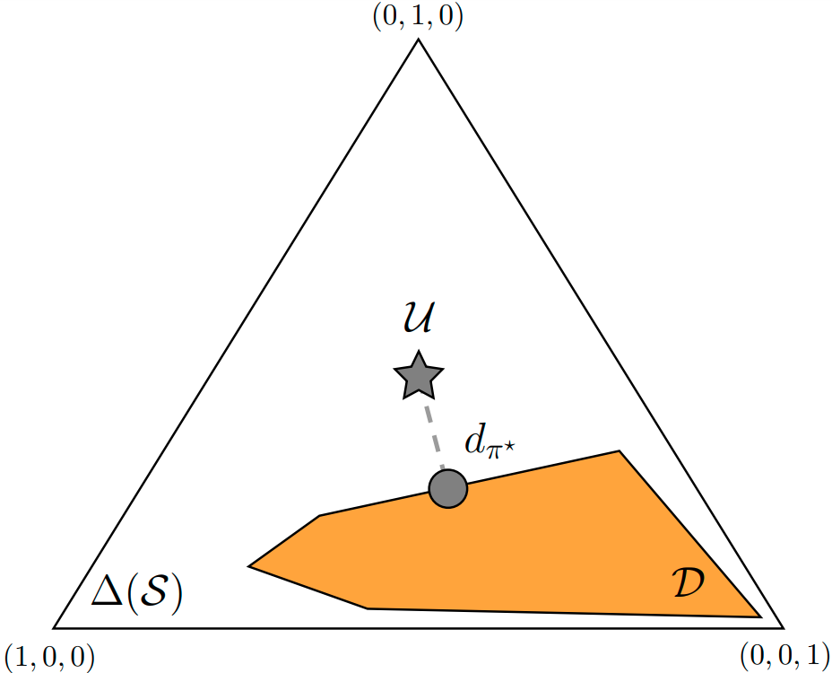

---

##### Abstract

We provide an explanation as to why maximum entropy data distributions are minimax optimal for approximate value iteration algorithms in the face of uncertainty regarding the underlying Markov decision process (MDP). We also investigate connections between such minimax optimal solutions and maximum state entropy exploration methods.

---

#### The content of this post is based on the following article

```BibTeX
@Article{Santos2024,
author={Santos, Pedro P. and Carvalho, Diogo S. and Sardinha, Alberto and Melo, Francisco S.},
title={The impact of data distribution on Q-learning with function approximation},
journal={Machine Learning},
year={2024},
month={Jun},
day={07},
issn={1573-0565},
doi={10.1007/s10994-024-06564-5},
url={https://doi.org/10.1007/s10994-024-06564-5}
}
```

---

##### Notation and setting
<span style="color:gray">
We denote with $\Delta(\mathcal{X})$ the set of probability distributions over set $\mathcal{X}$. We consider a discounted MDP setting $(\mathcal{S}, \mathcal{A}, p, \rho, r, \gamma)$, where $\mathcal{S}$ denotes the discrete state space, $\mathcal{A}$ denotes the discrete action space, $p: \mathcal{S} \times \mathcal{A} \rightarrow \Delta(\mathcal{S})$ is the state transition probability function , $\rho \in \Delta(\mathcal{S})$ is the initial state distribution, $r: \mathcal{S} \times \mathcal{A} \rightarrow \mathbb{R}$ is the reward function, and $\gamma \in [0,1)$ is a discount factor. A policy is a mapping  $\pi: \mathcal{S} \rightarrow \Delta(\mathcal{A})$. We denote with $P^\pi$ the $ \lvert \mathcal{S} \rvert \times \lvert \mathcal{S} \rvert$ matrix with elements $P^\pi(s,s') = \mathbb{E}_{A \sim \pi(\cdot \rvert s)}\left[ p(s' \rvert s, A) \right]$. We let $V^\star$ denote the optimal value function and $Q^\star$ denote the optimal action-value function.
</span>

---

## 1) Approximate value iteration algorithms

Approximate value iteration (AVI) algorithms aim to approximate $V^\star$ or $Q^\star$ using a function $f \in \mathcal{F}$, where $\mathcal{F}$ is some family of value or action-value functions. In practice, $\mathcal{F}$ can correspond to the space of functions induced by linear approximators or neural networks. Several well-known reinforcement learning (RL) algorithms such as fitted Q-iteration or deep $Q$-network can be seen as particular instances of AVI algorithms.

Below, we provide a very simplified pseudocode for an AVI algorithm, where we ommited the details regarding the update of the function approximator since they are irrelevant for our discussion.

---

#### Approximate value iteration algorithm pseudocode


---

As can be seen, at each iteration, a dataset of $M$ state action pairs is sampled from data distribution $\mu \in \Delta(\mathcal{S} \times \mathcal{A})$, a probability distribution over the state-action space. Then, the samples are used to update $f_n$ to produce the next approximator $f_{n+1}$. The algorithm returns approximator $f_N$, which we hope provides an accurate approximation of $V^\star$ or $Q^\star$.

We focus our attention on the impact of data distribution $\mu$ on the quality of our function approximator $f_N$, i.e., how well $f_N$ approximates $V^\star$ or $Q^\star$. We note that $\mu$ can correspond:
+ in the online RL setting, to the empirical frequency of visitation of state action pairs induced by a given policy (e.g., when data is generated by a given fixed behavior policy) or multiple policies (e.g., when a replay buffer is used). Under the online RL setting $\mu$ usually changes across iterations as the agent is able to control, up to some extent, the data generation process. 
+ in the offline/batch RL setting, to the empirical frequency of visitation of state action pairs induced by a fixed dataset, which can be arbitrary. Under the offline RL setting, $\mu$ is kept fixed across iterations since the agent cannot control the data generation process.

---

## 2) Concentrability coefficients

Concentrability coefficients aim to quantify the suitability of a given fixed data distribution $\mu$ under the offline/batch RL setting by studying error propagation in AVI algorithms. To put it in simple terms, concentrability coefficients are used to upper bound the error between $f_N$ and $V^\star$ or $Q^\star$ as $N \rightarrow \infty$. Thus, the lower the concentrability coefficient for a given data distribution $\mu$, the tighter the upper bound on the error.

We focus our discussion to the case where we are approximating $V^\star$. In this case, the data distribution verifies $\mu \in \Delta(\mathcal{S})$[^1], i.e., $\mu$ is a distribution over the state space $\mathcal{S}$. While there are several concentrability coefficients proposed in the literature, we focus our attention on the following [(Farahmand, 2010)](https://proceedings.neurips.cc/paper_files/paper/2010/file/65cc2c8205a05d7379fa3a6386f710e1-Paper.pdf)

<div>$$C(\mu) = (1-\gamma)^2 \sum_{m=0}^\infty m \gamma^{m-1} c(m, \mu),$$</div>

where

<div>$$c(m, \mu) = \max_{\pi_1, \ldots, \pi_m} \bigg\lVert \frac{\rho P^{\pi_1} P^{\pi_2} \ldots P^{\pi_{m}}}{\mu} \bigg\rVert_{2,\mu},$$</div>

$\gamma \in [0,1)$ is the discount factor, $\rho \in \Delta(\mathcal{S})$ is the distribution of initial states, and

<div>$$\bigg\lVert \frac{\beta}{\mu} \bigg\lVert_{2,\mu} = \Bigg( \sum_{s \in \mathcal{S}} \mu(s) \big( \beta(s) / \mu(s) \big)^2 \Bigg)^{1/2},$$</div>

for arbitrary $\beta \in \Delta(\mathcal{S})$.

---

##### Taking a closer look at the concentrability coefficient
<span style="color:gray">

Consider data distribution $\mu$ is fixed. We can interpret $C(\mu)$ as follows:

+ first, note that $\big\lVert \frac{\beta}{\mu} \big\rVert_{2,\mu}$, as defined above for arbitrary $\beta$, increases if $\beta(s)$ is high for states where $\mu(s)$ is small. Intuitively, $\big\lVert \frac{\beta}{\mu} \big\rVert_{2,\mu}$ is high if $\beta$ puts lots of probability mass in states that have low probability under $\mu$.
+ second, for fixed $m$ and $(\pi_1, \pi_2, \ldots, \pi_m)$, $\rho P^{\pi_1} P^{\pi_2} \ldots P^{\pi_m}$ corresponds to the expected frequency of visitation of states after $m$ steps when the distribution of initial states is $\rho$ and  the agent follows policies $(\pi_1, \pi_2, \ldots, \pi_m)$ at time steps $t=1, 2, \ldots, m$, respectively. Hence, $\big\lVert \frac{\rho P^{\pi_1} P^{\pi_2} \ldots P^{\pi_m}}{\mu} \big\rVert_{2,\mu}$ is high if underrepresented states in $\mu$ are visited with high probability after $m$ steps under policies $(\pi_1, \pi_2, \ldots, \pi_m)$.
+ third, for a given $m$, we compute $c(m,\mu)$ by searching for a set of policies $(\pi_1, \pi_2, \ldots, \pi_m)$ that maximizes $\big\lVert \frac{\rho P^{\pi_1} P^{\pi_2} \ldots P^{\pi_m}}{\mu} \big\rVert_{2,\mu}$. I.e., we search for a set of policies such that the induced state distribution in $m$ steps is high for underrepresented states in $\mu$.
+ finally, $C(\mu)$ corresponds to a weighted sum of coefficients $c(m,\mu)$, where we note that the maximization over policies $(\pi_1, \pi_2, \ldots, \pi_m)$ is performed independently for each $m$.

</span>

---

## 3) Optimizing concentrability coefficients

Since the upper bound on the error of the function approximator generated by our AVI-algorithm becomes tighter as the concentrability coefficient $C(\mu)$ decreases, it seems reasonable to study the computation of the optimal data distribution from the point of view of concentrability. Thus, we now cast the problem of finding the optimal data distribution, $\mu^\star \in \Delta(\mathcal{S})$, as the optimization problem

<div>$$\mu^\star = \argmin_{\mu \in \Delta(\mathcal{S})} C(\mu).$$</div>

Before showing how the optimization problem above can be solved, we make two important remarks.

First, we emphasize that, since we are considering an offline/batch RL setting, we let $\mu \in \Delta(\mathcal{S})$, i.e., $\mu$ is an arbitrary data distribution. Naturally, $\mu^\star$ may not correspond to an expected frequency of visitation of states induced by a given policy. This is because the set of expected frequencies of visitation of states induced by all policies is generally a subset of $\Delta(\mathcal{S})$ since the agent is restricted by the dynamics of the MDP when interacting with the environment. Nevertheless, we note that, if one is able to find $\mu^\star$ by solving the problem above, such distribution can still be useful since:
+ if one has access to a simulator of the environment, or a learned version thereof, it can be directly used to sample experience accordingly. 
+ if one has access to a dataset of transitions, a reweighting scheme can be applied to the samples to match $\mu^\star$.

Second, we note that, to compute $\mu^\star$ as defined by the problem above, one needs to have access to the initial distribution of states, $\rho$, as well as to the transition probability function $p$. This is due to the dependence of $C(\mu)$ on such variables. One possible solution to such a problem is to learn such quantities first (e.g., by exploiting a dataset of previously sampled trajectories) and then proceed to find $\mu^\star$.

If the arguments above do not convince you, for now, simply assume we want to consider $\mu \in \Delta(\mathcal{S})$ and that $\rho$ and $p$ are known. We will revisit both assumptions later in our discussion. We now proceed to show that the problem above can be formulated as a two-player game.

### $C(\mu)$ is a best response of an adversary player to $\mu$

Note that a different set of variables $(\pi_1, \pi_2, \ldots, \pi_m)$ is considered in the maximization to compute each of the coefficients $c(m, \mu)$. Thus, let $\Pi_m = (\pi_1^m, \pi_2^m, \ldots, \pi_m^m)$ denote the set of policies that are considered in the maximization to compute coefficient $c(m, \mu)$. Then, $\Pi = ( \Pi_1, \Pi_2, \Pi_3, \ldots )$ denotes the set of all policies that are considered in the computation of $C(\mu)$.

Let also \$\Pi^\star_m = (\pi_1^{m,\star}, \pi_2^{m,\star}, \ldots, \pi_m^{m,\star})\$ denote the set of optimal policies involved in computing coefficient $c(m, \mu)$. Then, $\Pi^\star = ( \Pi_1^\star, \Pi_2^\star, \Pi_3^\star, \ldots )$ denotes the set of all maximizing policies associated with the computation of all coefficients $c(m, \mu)$. 

Given the above, we can rewrite $C(\mu)$ as

<div>$$C(\mu) = \max_{\Pi} C(\mu, \Pi) = C(\mu, \Pi^\star),$$</div>

where
+ we redefined $C(\mu)$ by making explicit the dependence on the set of policies $\Pi$. 
+ the equality holds true given that we are considering different sets of variables $\Pi_m$ for the optimization of each coefficient $c(m, \mu)$.

As can be seen above, $C(\mu)$ can be interpreted as a best response of an adversary player (the maximizing player) to $\mu$.


### Formulating the two-player game

We now formulate the problem of finding the optimal data distribution from the point of view of concentrability as

<div>$$\mu^\star = \argmin_{\mu \in \Delta(\mathcal{S})} \max_\Pi C(\mu, \Pi).$$</div>

As seen, the problem above can be interpreted as a two-player game where:
+ the minimizing player aims to select $\mu$ so that $C(\mu, \Pi)$ is minimized.
+ the maximizing (adversary) player aims to select $\Pi$ so that $C(\mu, \Pi)$ is maximized.

The intuition behind the two-player game above is as follows: first, the minimizing player selects a given distribution $\mu$; then, the maximizing player aims at selecting $\Pi$ such that underrepresented states in $\mu$ are visited with high probability when running the set of policies $\Pi$ in the MDP.

---

#### Computing the optimal data distribution

<span style="color:gray">
We refer to Sec. 3.2 of our article where we propose a gradient descent-based algorithm to solve the two-player game above. In summary, we exploit the fact that $\max_\Pi C(\mu, \Pi)$ is convex with respect to $\mu$ and employ a gradient descent-based update scheme that, combined with a projection step to keep iterates $\mu_t$ inside the probability simplex, iteratively updates $\mu_t$ such that we approximate $\mu^\star$.
</span>

---

As previously discussed, to compute the optimal data distribution as described by the two-player game above, one needs to know (or learn) both the initial states distribution, $\rho$, and the transition probability function, $p$. In the next section, we relax such assumption and assume minimal knowledge regarding the underlying MDP: we assume only the state space $\mathcal{S}$ and action space $\mathcal{A}$ are known.

---

## 4) Maximum entropy data distributions are (minimax) optimal in the face of uncertainty regarding the underlying MDP

If we do not know the initial states distribution, $\rho$, and the transition probability function, $p$, we cannot compute $C(\mu)$. Hence, we introduce

<div>$$\tilde{C}(\mu) = (1-\gamma)^2 \sum_{m=0}^\infty m \gamma^{m-1} \tilde{c}(m, \mu)$$</div>
<div>$$\tilde{c}(m, \mu) = \max_{\tilde{\rho}, \hspace{0.03cm} \tilde{p}, \pi_1, \ldots, \pi_m } \bigg\lVert \frac{\tilde{\rho} \tilde{P}^{\pi_1} \tilde{P}^{\pi_2} \ldots \tilde{P}^{\pi_m}}{\mu} \bigg\rVert_{2,\mu},$$</div>

where the maximization above is taken over $\tilde{\rho} \in \Delta(\mathcal{S})$ and $\tilde{p} \in \Delta(\mathcal{S})^{|\mathcal{S}| |\mathcal{A}|}$, as well as policies over the policies $(\pi_1, \ldots, \pi_m)$, and $\tilde{P}^\pi$ denotes the expected transition probability function for policy $\pi$ under an MDP with transition probability function $\tilde{p}$. As can be seen, one does not need to know $\rho$ nor $p$ to compute $\tilde{C}(\mu)$ since we are taking the worst case across all possible distributions of initial states and transition probability functions.

Focusing on a given coefficient $\tilde{c}(m, \mu)$, it should be clear that, by considering all possible $\tilde{\rho}$'s, $\tilde{p}$'s and policies $(\pi_1, \ldots, \pi_m)$, the set of possible distributions $\tilde{\rho} \tilde{P}^{\pi_1} \tilde{P}^{\pi_2} \ldots \tilde{P}^{\pi_m}$ is $\Delta(\mathcal{S})$, for all $m \in \mathbb{N}$. Thus,

<div>$$\tilde{c}(m, \mu) = \max_{ \beta \in \Delta(\mathcal{S})} \bigg\lVert \frac{\beta}{\mu} \bigg\rVert_{2,\mu},$$</div>

for all $m \in \mathbb{N}$. Since coefficients $\tilde{c}(m, \mu)$ are now independent of $m$,

<div>$$\tilde{C}(\mu) = \max_{ \beta \in \Delta(\mathcal{S})} \bigg\lVert \frac{\beta}{\mu} \bigg\rVert_{2,\mu}.$$</div>

Thus, in this setting, the problem of finding the optimal data distribution becomes 

<div>$$\begin{align*}
\mu^\star &= \argmin_{\mu \in \Delta(\mathcal{S})} \tilde{C}(\mu) \\ &= \argmin_{\mu \in \Delta(\mathcal{S})} \max_{\beta \in \Delta(\mathcal{S})} L(\mu, \beta),
\end{align*}$$</div>

where $L(\mu, \beta) = \lVert \beta / \mu \rVert_{2,\mu}$. Again, we can interpret the problem above as a two-player game where:
+ the minimizing player aims to select $\mu$ so that $L(\mu, \beta)$ is minimized.
+ the maximizing (adversary) player aims to select $\beta$ so that $L(\mu, \beta)$ is maximized.

It turns out that the problem above has a closed-form solution and $\mu^\star = \mathcal{U}$, where $\mathcal{U}$ denotes the uniform distribution over $\mathcal{S}$, equivalent to the maximum entropy distribution. The intuition behind such result is that, for any $\mu$ picked by the minimizing player, the best response for the maximizing player, $\beta_\mu^\star$, is to pick $\beta$ such that all probability mass concentrates in the most underrepresented state in $\mu$. When the maximizing player chooses $\beta_\mu^\star$, it yields a value $L(\mu, \beta_\mu^\star)$ to the minimizing player that grows as the probability of the most underrepresented state in $\mu$ decreases. Hence, the optimal strategy for the minimizing player is to pick $\mu = \mathcal{U}$. Because of this, we say that the maximum entropy distribution is minimax optimal in the face of uncertainty regarding the underlying MDP.

In the next subsection, we provide a detailed explanation as to why $\mu^\star = \mathcal{U}$ for the problem above. If you find such result is intuitive and are in a rush, you can [skip to the next section where we elaborate on how our analysis can extend to the online setting.](#5-from-optimal-offline-distributions-to-exploratory-policies)

### The maximum entropy distribution is minimax optimal 

First, consider a fixed $\mu \in \Delta(\mathcal{S})$. We start by understanding what is the best response for the maximizing player to $\mu$, denoted $\beta_\mu^\star$. It holds that

<div>$$\begin{align*}
\beta_\mu^\star &= \argmax_{\beta \in \Delta(\mathcal{S})} L(\mu, \beta) \\ &= \argmax_{\beta \in \Delta(\mathcal{S})} \bigg\rVert \frac{\beta}{\mu} \bigg\rVert_{2,\mu} \\ &\stackrel{(a)}{=} \argmax_{\beta \in \Delta(\mathcal{S})} ( \beta^\top U \beta )^{1/2}\\ &\stackrel{(b)}{=} \bigg( \argmax_{\beta \in \Delta(\mathcal{S})} \beta^\top U \beta \bigg)^{1/2},
\end{align*}$$</div>

where in (a) we rewrote the weighted norm as the square root of a quadratic form with $U = \text{diag}\Big(\frac{1}{\mu(s_1)}, \ldots, \frac{1}{\mu(s_{|\mathcal{S}|})}\Big)$, and in (b) we noted that the square root function does not change the maximizer as it is monotonically increasing. We are left with understanding what is the solution to the last equation above.

---

#### Bauer's maximum principle

<span style="color:gray">
Any function that is convex and continuous, and defined on a set that is convex and compact, attains its maximum at some extreme point of that set.
</span>

---

It holds that the quadratic form above is continuous and convex, since $U$ is diagonal and all entries are non-negative. Also, $\Delta(\mathcal{S})$, the probability simplex over the state-space, is compact and convex. Thus, given Bauer's maximum principle, we know that the solution to the optimization problem above lies on one of the extreme points of $\Delta(\mathcal{S})$, i.e., $\beta_\mu^\star$ consists of a vector of zeros except for a single entry that has a value of one. It should also be clear that, since we want to maximize the expression above, the best response satisfies $\beta_\mu^\star(s) = 1$, if $s = \argmax_{s \in \mathcal{S}}{1 / \mu(s)}$, and zero otherwise. Intuitively, the optimal response for the adversary is to put all probability mass in the state $s$ for which $1/\mu(s)$ is the highest (equivalent to putting all probability mass in the most underrepresented state in $\mu$). 

Now that we know what the best reponse of the adversary player to any $\mu$ looks like, we can go back to our original objective of computing $\mu^\star$. From the perspective of the minimizing player, for any picked $\mu$, the best response of the adversary player will be $\beta_\mu^\star$ as described above, yielding a value of

<div>$$\begin{align*}
L(\mu, \beta_\mu^\star) &= ( (\beta_\mu^\star)^\top U \beta_\mu^\star )^{1/2} \\ &= \Bigg( \max_{s \in \mathcal{S}} \frac{1}{\mu(s)}\Bigg)^{1/2},
\end{align*}$$</div>

where in the second equality above we noted that, since there is only one non-zero entry in $\beta_\mu^\star$ that corresponds to the state $s^\star = \argmax_{s \in \mathcal{S}}{1 / \mu(s)}$, we have that $(\beta_\mu^\star)^\top U \beta_\mu^\star = 1/ \mu(s^\star)$ and, hence, this is equivalent to taking the maximum value of $1/\mu(s)$ across all states.

Going back to our original objective,

<div>$$\begin{align*}
\beta_\mu^\star &= \argmin_{\mu \in \Delta(\mathcal{S})} \max_{\beta \in \Delta(\mathcal{S})} L(\mu, \beta) \\ &= \argmin_{\mu \in \Delta(\mathcal{S})} L(\mu, \beta_\mu^\star) \\ &= \argmin_{\mu \in \Delta(\mathcal{S})} \Bigg( \max_{s \in \mathcal{S}} \frac{1}{\mu(s)}\Bigg)^{1/2}.
\end{align*}$$</div>

Finally, note that if $\mu = \mathcal{U}$ we have that

<div>$$\Bigg(\max_{s \in \mathcal{S}} \frac{1}{\mu(s)} \Bigg)^{1/2} = |\mathcal{S}|^{1/2}.$$</div>

For any $\mu' \neq \mathcal{U}$, at least one state $s$ satisfies \$\mu'(s) < 1 / |\mathcal{S}|$, implying that 

<div>$$\Bigg(\max_{s \in \mathcal{S}} \frac{1}{\mu'(s)} \Bigg)^{1/2} > |\mathcal{S}|^{1/2},$$</div>

and, hence, $\mu^\star = \mathcal{U}$.


## 5) From optimal offline distributions to exploratory policies

As previously discussed, in general, the set of expected frequencies of visitation of states induced by all policies is a subset of $\Delta(\mathcal{S})$ because the agent is restricted by the dynamics of the MDP when interacting with the environment. Let $d_\pi$ denote the expected frequency of visitation of states associated with a given policy $\pi$.[^2] Let also $\mathcal{D}$ denote the set of expected frequencies of visitation of states induced by all policies for a given MDP. It should be clear that, in general, $\mathcal{D} \subset \Delta(\mathcal{S})$, as we illustrate in the figure below for the case of an MDP with $\mathcal{S}=(s_1,s_2,s_3)$.

If the underlying MDP is unknown, we showed in the previous section that the maximum entropy distribution over the state space, $\mathcal{U}$, is minimax optimal from the point of view of concentrability. We illustrate such distribution with a star in the figure below. Since, in general, the maximum entropy distribution may not be contained in \$\mathcal{D}\$, our result does not directly extend to the online case because it may not exist a policy that induces a uniform probability of visitation over all states.

Thus, one could try to find a policy $\pi^\star$, associated with a given $d_{\pi^\star}$, such that 

<div>$$\pi^\star = \argmin_{\pi} \text{KL}(d_\pi \hspace{0.05cm} \lVert \hspace{0.05cm} \mathcal{U}),$$</div>

where $\text{KL}$ denotes the KL-divergence. Essentially, we are projecting our minimax solution, $\mathcal{U}$, onto set $\mathcal{D}$, as we illustrate in the figure below with the dashed line. We denote the result of this projection step with point $d_{\pi^\star}$ in the figure below.

---

#### Illustration of different sets of data distributions for a three-state MDP

<p align="center">

</p>

---

However, we note that

<div>$$\begin{align*}
\text{KL}(d_\pi \hspace{0.05cm} \lVert \hspace{0.05cm} \mathcal{U}) &= \sum_{s \in \mathcal{S}} d_\pi(s) \log\Bigg(\frac{d_\pi(s)}{1/|\mathcal{S}|}\Bigg) \\ &= \sum_{s \in \mathcal{S}} d_\pi(s) \Big( \log |\mathcal{S}| + \log d_\pi(s) \Big) \\ &= \log |\mathcal{S}| - \mathcal{H}(d_\pi),
\end{align*}$$</div>

where $\mathcal{H}(d_\pi)$ denotes the entropy of distribution $d_\pi$. Looking at the equation above, we can see that minimizing the KL-divergence to $\mathcal{U}$ is equivalent to maximizing $\mathcal{H}(d_\pi)$ since $\log|\mathcal{S}|$ is constant. Hence,

<div>$$\begin{align*}
\pi^\star &= \argmin_{\pi} \text{KL}(d_\pi \hspace{0.05cm} \lVert \hspace{0.05cm} \mathcal{U}) \\ &= \argmax_{\pi} \mathcal{H}(d_\pi),
\end{align*}$$</div>

where the last objective above is precisely that of maximum entropy state exploration, i.e., finding a policy that induces an expected frequency of visitation of states with the highest entropy possible.

Intuitively, we showed that if we project our minimax solution, $\mathcal{U}$, onto the set $\mathcal{D}$, such solution is equivalent to the problem of maximum state entropy exploration [(Hazan, 2018)](https://arxiv.org/pdf/1812.02690). In the figure above, this means that point $d_{\pi^\star}$ is both the solution to the projection of the minimax solution onto set $\mathcal{D}$, as explained before, as well as the solution attained by maximum state entropy exploration methods. This motivates the use of maximum state entropy exploration methods when one is uncertain about the underlying MDP.

---

##### Acknowledgments

Pedro P. Santos thanks Francisco Melo, Diogo Carvalho and Jacopo Silvestrin for comments provided on an early version of this blog post. Pedro P. Santos thanks Prof. João Xavier for the feedback provided during the project of the non-linear optimization course at IST, which addressed some of the topics covered in this blog post.

---

##### BibTeX citation


```BibTeX
@Article{Santos2024,
author={Santos, Pedro P. and Carvalho, Diogo S. and Sardinha, Alberto and Melo, Francisco S.},
title={The impact of data distribution on Q-learning with function approximation},
journal={Machine Learning},
year={2024},
month={Jun},
day={07},
issn={1573-0565},
doi={10.1007/s10994-024-06564-5},
url={https://doi.org/10.1007/s10994-024-06564-5}
}
```

[^1]: The analysis can be equivalently extended to the case where $\mu \in \Delta(\mathcal{S} \times \mathcal{A})$.

[^2]: Depending on the exact way a given policy $\pi$ is used to interact with the environment, the definition of $d_\pi$ may differ. For example, depending on the way one resets, or does not reset at all, the agent back to an initial state during the agent-environment interaction $d_\pi$ may be defined as an average or discounted expected frequency of visitation of states. Since our results hold regardless of the exact definition of $d_\pi$, as far as $d_\pi$ is a valid probability distribution, we omit such details from the text.
